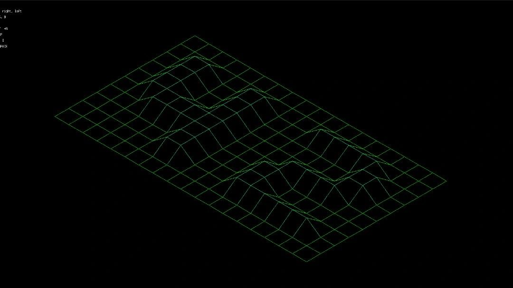
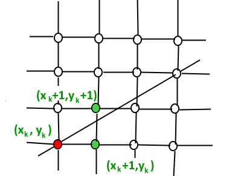
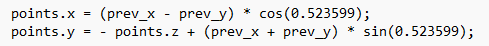
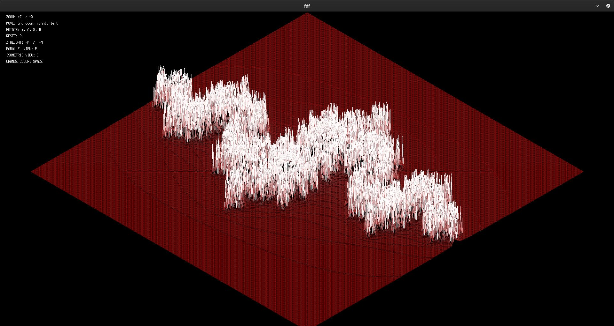
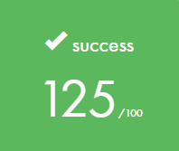

# FDF
This project involves creating a 3D representation model of a landscape by connecting points (x, y, z), where X represents the horizontal position, Y represents the vertical position, and Z corresponds to the height. To draw the map, the program reads a very simple file.

Input:

images/EXAMPLEFDF.jpg

Output:

Check my fdf on GitHub Here.

## MiniLib X
Minilib X is a simple graphics library provided to 42 students to complete this project. The library provides functions for opening a graphical window, drawing pixels on the screen, and handling mouse and keyboard events. You can see a more comprehensive documentation at this link harm-smits.github.io/42docs/libs/minilibx.

## Line drawing
Given the coordinates of two points A(x1, y1) and B(x2, y2), the objective is to determine all the intermediate points necessary to draw the line AB on a computer screen composed of pixels.

To draw the lines correctly, I used an algorithm called Bresenham. The algorithm works by incrementally selecting the next pixel to plot along the line between two given points. It considers the slope of the line segment and intelligently chooses the pixels that best approximate the ideal line while minimizing error. By efficiently determining which points to plot, the Bresenham algorithm achieves accurate line drawing with minimal computational overhead.

## Isometric projection
In the FdF project, isometric projection is utilized to represent 3D objects on a 2D screen. Isometric projection involves projecting three-dimensional objects onto a two-dimensional plane in a way that preserves the relative proportions and angles of the object's faces.

To obtain the projection, I simply transformed the x and y coordinates using this calculation:

julia.fdf

Grade

